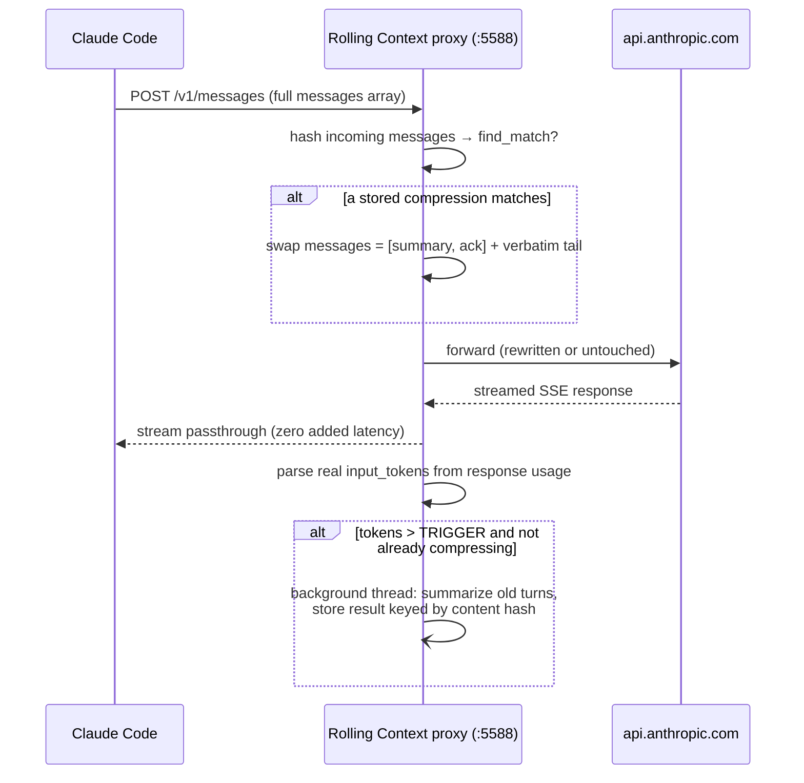
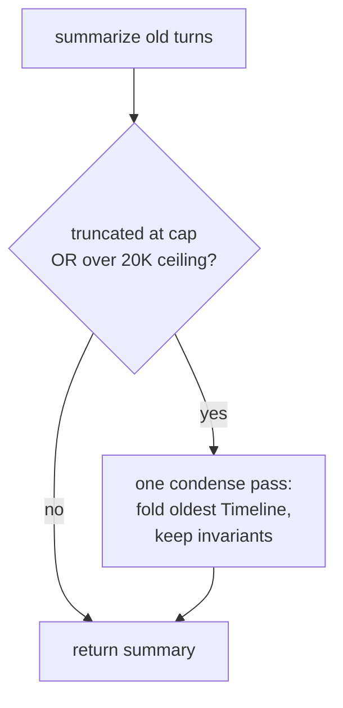

# Rolling Context — Design Brief

*How the proxy works, why its thresholds sit where they do, and an honest account of what it costs.*

---

## The one-paragraph version

Claude Code re-sends your **entire** conversation to the API on every turn, and as a session grows that prefix gets re-billed turn after turn. The built-in `/compact` already fixes the *cost* of that — it caps the prefix — but it does so by throwing the whole conversation away and replacing it with a lossy summary, so after a few compactions you're reasoning from a summary of a summary. Rolling Context sits between Claude Code and Anthropic as a tiny, zero-dependency proxy. When a conversation crosses a token threshold, it summarizes the **old** turns into one continuously-merged timeline and keeps the **recent** turns byte-for-byte intact — so aggressive compression doesn't cost you the live working set. **This is a retention tool, not a cost-saver.** Measured against `/compact`, it costs a *modest premium*, not a saving: you pay a little more to keep the recent detail exact. No API key, no config, no latency on the critical path. Whether that trade is worth it depends on your setup; §6 gives the honest use-it / avoid-it call.

---

## 1. The problem, stated in money

Every token you carry in context is re-billed on every turn — at cache-read rates once caching kicks in. So a session's cumulative input cost is **the sum of the prefix size over all turns**. Left unmanaged, that prefix only grows, so cost climbs faster than linearly with session length: each new turn is billed against an ever-larger prefix. A larger context window doesn't fix this — it just raises the ceiling the prefix climbs toward before anything caps it.

A second effect sharpens this. **Cache misses:** the prompt cache has a TTL (5 min default). Read a diff, get coffee, come back, and the next turn re-*writes* the whole prefix at the 1.25× write rate instead of reading it at 0.1×. The larger the prefix, the more a single cold turn costs.

(Earlier Sonnet-4/4.5-era 1M models added a third force — a `2× input / 1.5× output` premium on everything above 200K prompt tokens. Current Opus and Sonnet price the full 1M window [flat][price], so that penalty band no longer applies; the numbers below assume flat pricing.)

Capping the prefix bends that super-linear curve back toward a line — **but Claude Code's built-in `/compact` already caps the prefix.** The money problem is solved in the box. What `/compact` *pays* for that cap — discarding the whole conversation each time it fires — is the actual problem this proxy addresses. So read this section as *the mechanism*, not the pitch: §5 is blunt that against the real baseline the proxy costs slightly more, not less.

---

## 2. How it works

The proxy is a localhost HTTP reverse proxy (Python stdlib, no pip deps). Installation points Claude Code at it by setting `ANTHROPIC_BASE_URL` to `http://127.0.0.1:5588`; the proxy forwards to the real API. It is **stateless** and **content-addressed** — it has no notion of sessions, users, or subagents. It only sees request bodies and matches them by content hash.

Key properties fall straight out of the content-hash design:

- **Multiple conversations, subagents, branches — all just work.** Each has unique content → unique hashes → its own independent compression entry. A subagent that crosses the threshold is compressed on its own; nothing bleeds between conversations.
- **Never blocks.** The client is served the upstream stream first; summarization runs in a background thread and is applied on the *next* request.
- **Nothing to corrupt.** Restart the proxy anytime; worst case is one extra compression cycle.
- **Transcripts preserved.** Claude Code still writes full JSONL locally; the proxy only rewrites what goes *over the wire*.

**What compression does to the array.** When a conversation's real input tokens (read from the upstream response's `usage`) exceed the trigger, the proxy summarizes `messages[0:cut]` into a structured timeline (Active Goal / Timeline / Current State / Key Details) and produces `[summary, ack] + recent_verbatim`. The cut is chosen so it never splits a tool-use/tool-result pair and never orphans the current task. On the next request, the proxy hashes the incoming messages, finds the stored compression, and swaps the summary prefix in front of the still-verbatim tail — preserving Claude Code's own cache breakpoints on that tail.

**Summarization is nearly free** in the default "native" mode. The proxy clones the session's own request (same model, system, tools, truncated at the cut), so Anthropic serves it as a [prompt-cache][cache] read: a few hundred fresh tokens to summarize a ~70K span, not a second full pass. Because the request keeps the session's own shape, it also clears the subscription-OAuth classifier that would 429 a naked side request.

**Keeping the summary from saturating.** A rolling summary that only ever grows carries a failure mode inside it. The original contract told the summarizer to copy the previous summary forward unchanged and append the new events after it. Pair "copy forward, then append" with a fixed output cap and you get a trap: once the carried-forward text alone approaches the cap, there's no room left for the newest events, and since the old text is written first, it's the *newest* work that gets cut. The summary saturates and starts dropping the very turns it exists to protect. How often real sessions reached that ceiling was never billed or measured — but it's a structural certainty for any session long enough to fill the cap, not a tail risk.

The fix swaps "copy forward, append" for **oldest-first decay** on a tiered contract. Three things never shrink: the Active Goal, the user's stated constraints, and the Key Details. Only the Timeline decays, and it decays from the *old* end. Recent steps stay detailed; as the summary nears its budget, the oldest steps merge into denser milestone bullets. The newest events are never the ones sacrificed.

A prompt alone can't guarantee that, because it rests on the model obeying instructions. So the size bound lives in code, not in goodwill. Two budgets do the work: a ~16K-token soft target the prompt asks for, and a 20K-token hard ceiling set as the real `max_tokens`. After each summarization the proxy reads the API's `stop_reason`; if the model hit the token cap, or the returned summary still measures over the ceiling, it runs exactly one condense pass — re-summarizing under the same tiered contract, folding the oldest Timeline, keeping the invariants. One pass, never a loop. Both summarizer paths, the default native mode and the flattened fallback, carry the same guard.

**What's proven, and what isn't.** The size bound is deterministic and tested: the guard fires on a truncated `stop_reason` and on an over-ceiling measurement, runs a single condense pass, and leaves a normal summary untouched — checked for the native summarizer and both flattened wire formats ([`test_summary_decay_guard.py`](../tests/test_summary_decay_guard.py), [`test_flattened_guard.py`](../tests/test_flattened_guard.py)), with the SSE `stop_reason` parse covered on its own ([`test_sse_stop_reason.py`](../tests/test_sse_stop_reason.py)). What a mock backend can't prove is the other half: that a real model, told to shed oldest-first, actually does. That waits on a live check — one long session run through repeated compressions, confirming from the proxy log that summary size settles at or below the soft target and the guard rarely fires. The code guarantees the summary stays bounded; the contract, not yet independently confirmed, is what aims that bound at the oldest material.

---

## 3. The keep policy: turns, not just tokens

The recent tail is chosen by a **blend**, not a flat token budget: keep the last *N* whole user-turns (`ROLLING_CONTEXT_KEEP_TURNS`, default 8), never fewer than a floor (`ROLLING_CONTEXT_KEEP_FLOOR`, default 3), clamped by the `TARGET` token ceiling (`ROLLING_CONTEXT_TARGET`, default 40K).

Why blend rather than a flat token count? Because a single turn's size varies ~40× (in the telemetry that calibrated this: median 1.6K tokens, p95 11K, p99 **67K** — a giant file read). A flat token budget mis-allocates against that spread: on cheap stretches it hoards ~25 stale small turns; on a big-dump turn it blows the entire budget on **one** turn and summarizes away the reasoning that surrounds it. Choosing by *whole turns* keeps the unit of coherence intact — a mid-task tool chain is never split — while the token ceiling still caps cost. The floor guarantees you never keep just one giant dump with none of its context.

---

## 4. Why the thresholds sit where they do

The two numbers that matter are the **trigger** (100K) and the **keep** (blend around 40K). Neither was guessed. They were chosen against a first-principles cost model calibrated to real session telemetry, using the API's [published relative pricing][price]. The model and its inputs are committed under [`docs/cost-model/`](cost-model/) — every figure below is reproducible.

### Relative pricing (the units the model runs in)

| Operation | Cost, relative to fresh input |
|---|---|
| Fresh input token | 1× |
| Prompt-cache **read** | 0.1× |
| Prompt-cache **write** | 1.25× (5-min TTL) |
| Output token | 5× |

(Opus 4.8 prices the full 1M window flat — there is no >200K long-context multiplier to model. The cache-read rate is what makes an unmanaged prefix expensive: cheap per turn, but paid on the whole prefix, every turn.)

### The trade-off the trigger balances

Compression isn't free: rewriting the prefix **invalidates the prompt cache** for everything downstream, so the first turn after a compression re-writes the kept tail at 1.25× instead of reading it at 0.1×. On top of that, the summary itself is billed as output, up to the 16K soft cap — the single largest slice of each compaction's cost. That overhead pushes toward compressing **rarely** (higher trigger, shed more each time). Meanwhile, carrying a bigger prefix every turn at 0.1× pushes toward compressing **early** (lower trigger). The optimum is where those meet.

Replaying the **full current mechanics** — blend keep, the rolling summary that grows and saturates the 16K cap, the decay guard, and the cache-invalidation penalty — over **1,940 real sessions (114K turns)** puts the cost optimum at **exactly 100K** ([`fullmech.py`](cost-model/fullmech.py)). It is a flat-bottomed basin: within 1% of optimum from **90K–120K**, within 2% from 80K–130K. The practical read:

- **100K is the optimum, and it's the value the tool ships.** The optimum stays in 90–120K across every summary-size assumption swept.
- Going **too low** is the real mistake: a 50K trigger costs ~36% more, because you pay the tail-rebuild penalty *and* the summary-output cost too often. Pushing to 200K costs ~11% more — you then carry the extra prefix on every turn.
- This is the cheapest way to run *the proxy*. It does **not** mean the proxy is cheaper than `/compact` — see §5.

**Session length is why 100K, and not lower.** Only **~28% of real sessions ever reach 100K** of context; the median tops out near 74K and never compacts at all ([`length_cond.py`](cost-model/length_cond.py)). Among the sessions that do cross, the amortization break-even — how many more turns a compaction needs before its overhead pays back — is **~70–100 turns**, dominated by that up-to-16K summary output. That break-even nearly equals the **median remaining length at 100K (~74 turns)**, which is exactly the condition that pins the optimum there: trigger any lower and you compact sessions that end before they amortize; any higher and long sessions carry an oversized prefix. Conditioning the trigger on how long a session has *already* run adds almost nothing (< 0.1% in replay, [`adaptive.py`](cost-model/adaptive.py)) — because reaching a high context is itself the signal of a long session.

On the keep side, the blend (`N=8, floor=3, ~40K cap`) earns its extra complexity on a replay of the real sessions that cross the trigger ([`replay.py`](cost-model/replay.py)). At the **same 5-turn coverage** (99.3%) it costs **~12% less** than a flat 40K-token budget *of the same policy*, and it removes that policy's 1-in-6 "keep only a giant dump" coherence hazard: 16% of flat-policy compressions collapse to a single kept turn, against 0% for the blend. (This is a keep-policy comparison — blend vs. flat, both inside the proxy — not a comparison against `/compact`.)

---

## 5. What it costs — and why cost is not the reason to run it

**What this is:** a first-principles cost model in the API's real relative units, driven by **1,940 real Claude Code sessions (114K turns)** and the **full current mechanics** — the blend keep policy, a rolling summary that grows with the dropped history and saturates its 16K soft cap (the guard fires on ~37% of compactions), and the cache-invalidation penalty each compression pays. It is a model calibrated to real usage, not a live billing A/B, so treat every figure as a grounded estimate, not an invoice. Scripts under [`docs/cost-model/`](cost-model/): [`fullmech.py`](cost-model/fullmech.py), [`matched.py`](cost-model/matched.py), [`crossover.py`](cost-model/crossover.py), [`setpoint.py`](cost-model/setpoint.py).

**The headline, stated plainly: this proxy does not save money against Claude Code's built-in `/compact`. It costs modestly more.** Both cap the prefix, so both make a long session's input cost grow linearly rather than quadratically. The difference is what each keeps. Native `/compact` discards the whole conversation and keeps only a summary. The proxy additionally keeps a verbatim recent tail, *and* produces a summary, *and* — because that tail raises the floor it compacts back down to — fires somewhat more often. More work costs more.

**Native's auto-compact threshold is a knob you control** (Claude Code's `/config`), so the fair comparison is at a *matched* trigger — both policies compacting at the same context size. At every matched trigger the proxy costs more, because it does everything native does *plus* carries a verbatim tail *plus* compacts a little more often ([`matched.py`](cost-model/matched.py), 1,940 sessions):

| Trigger (both policies) | Native `/compact` | This proxy | Proxy premium |
|---|--:|--:|--:|
| 60K (aggressive) | $4,226 | $6,226 | **+47%** |
| **100K (the proxy default)** | **$4,477** | **$5,509** | **+23%** |
| 160K | $5,176 | $5,867 | +13% |
| 200K | $5,614 | $6,135 | +9% |
| 300K | $6,690 | $7,075 | +6% |

(Dollars are the model's relative units over the corpus, not an invoice.) The premium shrinks as the trigger rises — the fixed tail is a smaller slice of a bigger prefix — but it never reaches zero. **There is no auto-compact setting the proxy undercuts on cost.**

The proxy *looks* cheaper only in one rigged comparison: it compacting aggressively (100K) against native left lax. Those two cross near a **190K native trigger (~19% of a 1M window)** ([`crossover.py`](cost-model/crossover.py)) — above that the early-compacting proxy wins. But that pits different behaviors, not different tools: if you want to compact at 100K, set native to 100K and pay ~19% less. Native is tunable, so the proxy can never win on cost by simply out-compacting it. (For reference, native's *default* compaction fires around a 129K median in this telemetry, [`setpoint.py`](cost-model/setpoint.py) — but since you can move it, the matched comparison above is the honest one. And "never compact" is ~80% dearer than either, but nobody runs it: the prefix would exceed the window.)

**The mirror scenario — pin the proxy, raise native.** If instead you leave the proxy at 100K and move *only* native's trigger up toward the window limit, the fixed proxy gets progressively cheaper: break-even near a 190K native trigger, ~18% cheaper at 300K, and **~50% cheaper at a near-limit 900K trigger** ([`crossover.py`](cost-model/crossover.py)). This is the one place the proxy could genuinely save money — *if* auto-compact on a 1M window sits high. Two caveats keep it honest. It is still the asymmetric comparison (native tuned low beats the proxy). And the entire gap lives in the **extreme tail**: these are corpus totals over 1,940 sessions, only ~1% of which ever reach 900K, with ten sessions accounting for ~42% of the 900K total and the *median* session costing about a dollar under any trigger. For ordinary use that never approaches the window, native-high versus proxy-100K is a wash. The ~50% only materializes if you actually run multi-thousand-turn, near-limit sessions.

**Correcting the record.** An earlier version of this brief claimed the proxy was *~12% cheaper* than native compaction. That number came from a mislabeled baseline in the cost model: the "native compact" row actually kept a 40K verbatim tail — i.e. it was the proxy's *own* policy at a higher trigger, not native compaction at all. True native compaction keeps no verbatim tail. Against it, the sign flips. The old claim is retracted.

**The one lever that could reverse it — and why subscription users can't pull it.** The proxy's per-compaction cost is dominated by the summary *output*, billed at the session model's output rate (Opus, $25/MTok). Point summarization at a cheaper model — Haiku, 5× cheaper output — and the picture changes: on **token/API billing**, a flattened Haiku summarizer at ~100K with a ~25K tail lands cost-neutral-to-cheaper than native `/compact` *while still keeping a verbatim tail*. Native `/compact` structurally cannot do this — it is locked to the session model. But **that lever is unavailable on a Pro/Max subscription, which is how this plugin is actually used.** Native mode forces the session model precisely so the cloned request passes Anthropic's subscription-OAuth classifier; routing a cheaper model requires flattened mode, whose bare, non-session-shaped request is exactly what that classifier is built to reject (the reason native mode exists — see the compressor module header's issue-#4 note). It is untested against a live backend, but the strong prior is rejection. **So for subscription users there is no cheaper-summarizer path, and the proxy is a budget premium over `/compact`, full stop.**

**On a subscription, "cost" is rate-limit budget, and the proxy burns more of it.** Nothing here is dollars on Pro/Max. But the same curves govern how fast you burn the rate-limit window, and the proxy — carrying the tail and compacting more often — spends **more** of that window than native `/compact` at any matched threshold: about +23% at the default 100K, ranging from ~+6% (lax triggers) to ~+47% (aggressive). If your only goal is to stretch the rate-limit window, native `/compact` at the same threshold is cheaper, and this proxy is the wrong tool.

**So why run it at all? Retention quality — and only that.** Native compaction replaces the whole conversation with a summary each time it fires, so at an aggressive threshold you are soon reasoning from a summary of a summary. The proxy keeps the recent tail **byte-for-byte** and summarizes only the old span, which is what lets you compress early (100K) without that degradation. The summary quality on the *old* material is comparable to native's — both are summaries — but the recent tail, the part you're actively working in, stays exact. That is the whole value proposition, and it costs the premium above. If you value keeping the live working set intact, the premium buys something real. If you want lower spend, it does not.

**Thinking tokens shift the percentage, not the dollars.** Extended-thinking tokens are billed as output and are *compression-invariant*: you generate the same reasoning for the current task regardless of prefix size, and Claude Code drops prior-turn thinking from the context it resends, so it never accumulates in the growing prefix at all. The model prices output at the telemetry median (≈330 tok/turn, i.e. light thinking). Heavier thinking (2–4K tok/turn) leaves the premium's dollar magnitude essentially unchanged while shrinking it as a percentage, because thinking inflates the shared denominator ([`think_sens.py`](cost-model/think_sens.py)).

Two further honest boundaries:

- **Short sessions are a wash.** Under ~100K of accumulated context — a 20-minute task — there is little to compress and the overhead isn't worth it. The tool is designed to do nothing there.
- **The proxy's own overhead is negligible.** Hashing the message array costs about **0.8 ms/request** at the operating point (~90K), and the upstream TLS handshake ~40 ms; both are dwarfed by the 2–15 second LLM stream they sit behind. Two proposed micro-optimizations were measured, then deliberately left unbuilt ([`profile_hash.py`](cost-model/profile_hash.py)).

---

## 6. When to use it, when to avoid it

The cost analysis settles the money question: at a matched trigger this proxy costs more than native `/compact`, always. So the decision isn't "is it cheaper." It's "do I need what the premium buys." Here's the honest call.

**Use it when:**

- **Your sessions are genuinely long.** Only ~28% of real sessions cross 100K at all (§4); below that the proxy does nothing. If you routinely run multi-hour, multi-hundred-K sessions, there's something to compress and a tail worth protecting.
- **You compact early and can't afford to lose the recent working set.** This is the one thing native `/compact` can't do: it replaces the whole conversation with a lossy summary every time it fires. The proxy keeps the recent turns byte-for-byte: the code you just read, the exact error text, the file you're editing. If you compress aggressively (100K) *and* need that recent detail exact, this is the only tool that gives you both.
- **You'll accept the premium for that.** About +23% over native at a matched 100K trigger (§5). If retention of the live working set is worth roughly a quarter more spend, the trade is real.
- **(API-key users only) You can point summarization at a cheaper model.** On token billing (not a subscription), `ROLLING_CONTEXT_MODEL=claude-haiku-4-5` in flattened mode can land cost-neutral-to-cheaper than native while still keeping a verbatim tail (§5). Validate summary quality first; a cheaper summarizer is a cheaper summary.
- **(Narrow tail case) You leave native auto-compact high and run monster sessions.** Pin the proxy at 100K, leave native near the window, and on multi-thousand-turn sessions the proxy is much cheaper, up to ~50% at a 900K native trigger (§5, [`crossover.py`](cost-model/crossover.py)). But this is ~1% of sessions; for ordinary use it's a wash.

**Avoid it when:**

- **Cost or rate-limit budget is your binding constraint.** Native `/compact`, optionally at a lower `/config` threshold, is strictly cheaper at any matched trigger. On a Pro/Max subscription the proxy just burns more of your rate-limit window (~+23% at 100K, up to +47% aggressive), and the one lever that could close the gap (a cheaper summarizer) is blocked by the subscription-OAuth classifier (§5). If you want to spend less, this is the wrong tool.
- **Your work stays under ~100K.** A 20-minute task never reaches the trigger. The proxy is built to do nothing there; run plain Claude Code.
- **You depend on server-side cache preservation.** Anthropic's native [Context Editing][ctxedit] clears old tool results *after* cache lookup, so it keeps the prompt cache warm, but only drops content, with no summary. This proxy summarizes, but rewrites client-side and so invalidates the cache. The two fight on the cache axis; you get one owner of tool-output lifecycle, not both. Combining them is future work behind a different architecture, not a config flag.
- **You need a guarantee about *what* a tight compression drops.** The code bounds the summary's *size* (§2): a 20K hard ceiling and a single condense pass, deterministic and tested. It doesn't prove the summary sheds *oldest-first* rather than newest. That rests on the model following the decay contract, and it isn't confirmed against a live backend yet (§2 gate). If which material survives a compression is safety-critical for you, wait for that check.

**Where the "ask Claude to write a handoff" workflow sits.** A widely-practiced alternative skips both `/compact` and this proxy: at a breakpoint, have the model write a handoff file, run `/clear`, and start a fresh session on it. This is mainstream. Anthropic's own session-management guidance lists `/clear` — "start a new session, usually with a brief you've distilled from what you just learned" — as one of five first-class context moves, and ships a `/rewind` "summarize from here" that writes "a handoff message ... from its future self" [ccsm]; the context-engineering guide recommends an external `NOTES.md` and a file-based memory tool for state that outlives the window [ctxeng]. Practitioners productized it: `/handoff` skills that emit a structured state doc and launch a fresh session [handoff], and Cline's **Memory Bank**, updated "before the window clears, letting you continue seamlessly in a fresh conversation" [membank]. A popular writeup puts it bluntly — "I never, ever `/compact`" — with a canonical HANDOFF schema of goal, state, decisions, mistakes, TODOs, gotchas, and file links [bswen]. Take the strongest version.

The one axis where the handoff genuinely wins — and §5's cost model doesn't cover it — is **cross-session resume after the prompt cache dies.** §5 measures *in-session* re-billing; the handoff advocates chase a different cost. Leave a long thread over lunch, the subscription cache expires, and resuming re-pays the entire history [bswen]. Neither `/compact` nor this proxy fully escapes that — both leave a prefix a cold resume must re-read. A one-screen handoff collapses the resume to a few hundred tokens. On the resume axis, handoff beats the proxy beats a raw resume. Real, and conceded.

But the popular variant forfeits the advantage its advocates claim. Anthropic's `/clear` is powerful precisely because *you* author the brief: "you write down what matters," "you control exactly what carries forward" [ccsm]. The practice people run inverts that — "*ask Claude* to create a HANDOFF" [bswen]. Once the model writes it, the handoff is a lossy model summary, the same failure class as `/compact`, and "you control what survives" is worth only the attention you spend auditing it. Anthropic names the deeper trap: "the model is at its least intelligent point when compacting," because context rot has already set in [ccsm]. A handoff authored at the end of a bloated four-hour session is written by exactly that degraded model. Its "avoids summary-of-summary" and "few hundred tokens" hold only if the doc is written *early* and *short*; write it late and it inherits the rot it was meant to escape.

Two things the proxy does that the handoff structurally can't. It keeps the recent tail **byte-for-byte** — `/clear` discards the exact file, error, and half-finished tool chain, and whatever the author missed is gone. And it never summarizes the whole history in one pass: each cycle folds the prior dense summary plus only the turns aged past the tail, so no summarization faces a saturated window — the incremental answer to "least intelligent when compacting."

One failure asymmetry seals it. A hallucinated handoff, once you `/clear`, is unrecoverable except by mining raw JSONL. A bad rolling summary is bounded: the verbatim tail still holds recent truth and the next compression re-merges from it. The handoff trades a continuous safety net for a clean slate, and a clean slate keeps no receipts.

So they compose, and the vendors say so. Cline recommends "Auto Compact ... for routine" with a manual state update "for important checkpoints" [membank]; Anthropic frames subagents and `/clear` as boundary tools, not session-long ones [ccsm]. At a real semantic boundary — task done, agent handoff, stepping away overnight — write the doc and `/clear`; nothing beats a clean window, a portable artifact, and a near-zero resume. Through one long entangled session where you can't predict which detail you'll need and won't stop to summarize, the proxy's verbatim tail and drift-resistant incremental summary are what the premium buys. Proxy through the long middle, handoff at the true boundary.

**The critical bottom line.** For the majority case, a Pro/Max subscription, which is how this plugin is actually installed, this is a premium retention tool, full stop. Its one path to cost-neutrality is closed exactly there, and its central quality claim, oldest-first shedding, is bounded in code but not yet independently verified against a live model. That's not a reason to avoid it. It's the reason to run it for the right motive: you want the recent working set kept verbatim under aggressive compression. Don't run it to save money on a subscription. It won't.

---

## References

- **Anthropic pricing** — per-token input/output and prompt-cache rates (and the legacy >200K long-context tier, now retired for current models): <https://platform.claude.com/docs/en/about-claude/pricing>
- **Prompt caching** — cache read/write rates and the 5-minute TTL the trigger economics turn on: <https://platform.claude.com/docs/en/build-with-claude/prompt-caching>
- **Context editing** — Anthropic's native, cache-preserving tool-result clearing (§6): <https://platform.claude.com/docs/en/build-with-claude/context-editing>
- **Cost model & telemetry** — the scripts behind every §4–§5 figure: [`docs/cost-model/`](cost-model/)
- **Claude Code session management** — Anthropic's own `/clear` vs `/compact` vs subagents guidance, and the "least intelligent point when compacting" observation (§6): <https://claude.com/blog/using-claude-code-session-management-and-1m-context>
- **Effective context engineering** — Anthropic on external memory (`NOTES.md`, file-based memory tool) and compaction (§6): <https://www.anthropic.com/engineering/effective-context-engineering-for-ai-agents>
- **HANDOFF-file practice** — a representative advocate for handoff-over-`/compact` and the cross-session resume argument (§6): <https://docs.bswen.com/blog/2026-06-29-claude-handoff-file-vs-compact/>
- **`/handoff` skill** — one productized write-state-then-fresh-session implementation (§6): <https://github.com/robertguss/claude-code-toolkit/tree/main/skills/handoff>
- **Cline Memory Bank** — markdown state files updated before the window clears; auto-compact for routine, manual update for checkpoints (§6): <https://docs.cline.bot/best-practices/memory-bank>

[price]: https://platform.claude.com/docs/en/about-claude/pricing
[cache]: https://platform.claude.com/docs/en/build-with-claude/prompt-caching
[ctxedit]: https://platform.claude.com/docs/en/build-with-claude/context-editing
[ccsm]: https://claude.com/blog/using-claude-code-session-management-and-1m-context
[ctxeng]: https://www.anthropic.com/engineering/effective-context-engineering-for-ai-agents
[bswen]: https://docs.bswen.com/blog/2026-06-29-claude-handoff-file-vs-compact/
[handoff]: https://github.com/robertguss/claude-code-toolkit/tree/main/skills/handoff
[membank]: https://docs.cline.bot/best-practices/memory-bank

---

## Appendix: code map (stable references)

| Concern | Location |
|---|---|
| Proxy handler, request interception, streaming | `proxy/server.py` → `ProxyHandler._handle_messages` |
| Trigger check (real usage > threshold) | `proxy/server.py` → `_handle_messages` (`total_input > TRIGGER_TOKENS`) |
| Atomic single-flight compression reservation | `proxy/server.py` → `CompressionStore.try_begin_compression` |
| Content-hash match / injection | `proxy/server.py` → `CompressionStore.find_match`, `_hash_messages` |
| Bounded store (cap + LRU evict) | `proxy/server.py` → `CompressionStore._evict_locked` |
| Rolling compression orchestration | `proxy/compressor.py` → `RollingCompressor.compress` |
| Blend keep-cut selection | `proxy/compressor.py` → `RollingCompressor._find_keep_index` |
| Native (prompt-cached) summarization | `proxy/compressor.py` → `RollingCompressor._summarize_native` |
| SSE parse + `stop_reason` capture | `proxy/compressor.py` → `RollingCompressor._parse_summary_sse` |
| Summary decay guard (condense on truncation/over-ceiling) | `proxy/compressor.py` → `_summarize_native`, `_condense_summary` |
| Flattened summarize + same guard | `proxy/compressor.py` → `_summarize_flattened`, `_summarize_flattened_once` |
| Tiered-decay + condense prompts | `proxy/compressor.py` → `SUMMARY_RULES`, `NATIVE_COMPACT_PROMPT`, `CONDENSE_PROMPT` |
| Install / `ANTHROPIC_BASE_URL` wiring | `hooks/start-proxy.sh`, `install.sh` |
| Configuration (all env vars) | `README.md` → Configuration |
| The economics, in full | `README.md` → "The economics: capping the prefix, and what it costs" |

*Defaults:* `ROLLING_CONTEXT_TRIGGER=100000`, `ROLLING_CONTEXT_TARGET=40000`, `ROLLING_CONTEXT_KEEP_TURNS=8`, `ROLLING_CONTEXT_KEEP_FLOOR=3`, `ROLLING_CONTEXT_STORE_MAX=32`.
