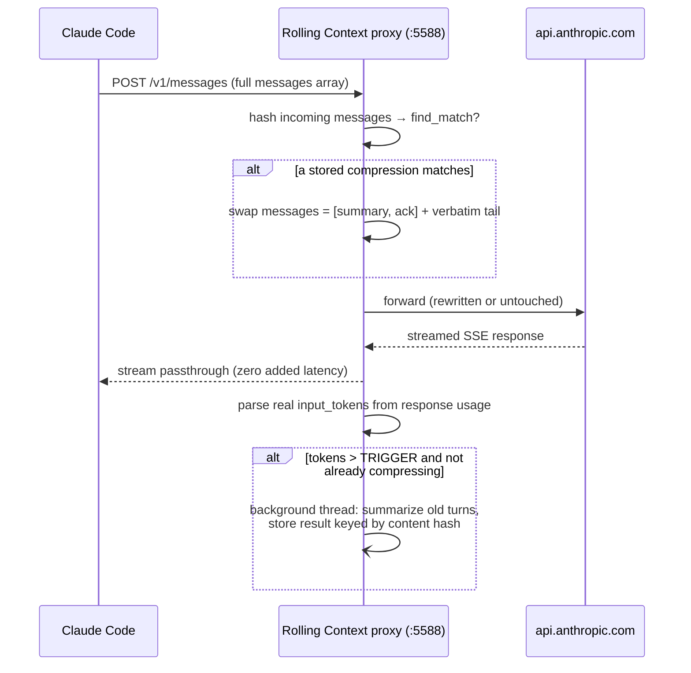

# Rolling Context — Design Brief

*How the proxy works, why its thresholds sit where they do, and what it is expected to save.*

---

## The one-paragraph version

Claude Code re-sends your **entire** conversation to the API on every turn. As a session grows, that prefix gets re-billed turn after turn, and the built-in `/compact` "fix" throws the whole thing away and replaces it with a lossy summary — so after a few compactions you're reasoning from a summary of a summary. Rolling Context sits between Claude Code and Anthropic as a tiny, zero-dependency proxy. When a conversation crosses a token threshold, it summarizes the **old** turns into one continuously-merged timeline and keeps the **recent** turns byte-for-byte intact. You stop paying for an ever-growing prefix, and you stop losing the detail that matters. No API key, no config, no latency on the critical path.

---

## 1. The problem, stated in money

Every token you carry in context is re-billed on every turn — at cache-read rates once caching kicks in. So a session's cumulative input cost is **the sum of the prefix size over all turns**. Left unmanaged, that prefix only grows, so cost climbs faster than linearly with session length: each new turn is billed against an ever-larger prefix. A larger context window doesn't fix this — it just raises the ceiling the prefix climbs toward before anything caps it.

A second effect sharpens this. **Cache misses:** the prompt cache has a TTL (5 min default). Read a diff, get coffee, come back, and the next turn re-*writes* the whole prefix at the 1.25× write rate instead of reading it at 0.1×. The larger the prefix, the more a single cold turn costs.

(Earlier Sonnet-4/4.5-era 1M models added a third force — a `2× input / 1.5× output` premium on everything above 200K prompt tokens. Current Opus and Sonnet price the full 1M window [flat][price], so that penalty band no longer applies; the numbers below assume flat pricing.)

Capping the prefix bends that super-linear curve back toward a line. That is the entire thesis.

---

## 2. How it works

The proxy is a localhost HTTP reverse proxy (Python stdlib, no pip deps). Installation points Claude Code at it by setting `ANTHROPIC_BASE_URL` to `http://127.0.0.1:5588`; the proxy forwards to the real API. It is **stateless** and **content-addressed** — it has no notion of sessions, users, or subagents. It only sees request bodies and matches them by content hash.

Key properties fall straight out of the content-hash design:

- **Multiple conversations, subagents, branches — all just work.** Each has unique content → unique hashes → its own independent compression entry. A subagent that crosses the threshold is compressed on its own; nothing bleeds between conversations.
- **Never blocks.** The client is served the upstream stream first; summarization runs in a background thread and is applied on the *next* request.
- **Nothing to corrupt.** Restart the proxy anytime; worst case is one extra compression cycle.
- **Transcripts preserved.** Claude Code still writes full JSONL locally; the proxy only rewrites what goes *over the wire*.

**What compression does to the array.** When a conversation's real input tokens (read from the upstream response's `usage`) exceed the trigger, the proxy summarizes `messages[0:cut]` into a structured timeline (Active Goal / Timeline / Current State / Key Details) and produces `[summary, ack] + recent_verbatim`. The cut is chosen so it never splits a tool-use/tool-result pair and never orphans the current task. On the next request, the proxy hashes the incoming messages, finds the stored compression, and swaps the summary prefix in front of the still-verbatim tail — preserving Claude Code's own cache breakpoints on that tail.

**Summarization is nearly free** in the default "native" mode. The proxy clones the session's own request (same model, system, tools, truncated at the cut), so Anthropic serves it as a [prompt-cache][cache] read: a few hundred fresh tokens to summarize a ~70K span, not a second full pass. Because the request keeps the session's own shape, it also clears the subscription-OAuth classifier that would 429 a naked side request.

---

## 3. The keep policy: turns, not just tokens

The recent tail is chosen by a **blend**, not a flat token budget: keep the last *N* whole user-turns (`ROLLING_CONTEXT_KEEP_TURNS`, default 8), never fewer than a floor (`ROLLING_CONTEXT_KEEP_FLOOR`, default 3), clamped by the `TARGET` token ceiling (`ROLLING_CONTEXT_TARGET`, default 40K).

Why blend rather than a flat token count? Because a single turn's size varies ~40× (in the telemetry that calibrated this: median 1.6K tokens, p95 11K, p99 **67K** — a giant file read). A flat token budget mis-allocates against that spread: on cheap stretches it hoards ~25 stale small turns; on a big-dump turn it blows the entire budget on **one** turn and summarizes away the reasoning that surrounds it. Choosing by *whole turns* keeps the unit of coherence intact — a mid-task tool chain is never split — while the token ceiling still caps cost. The floor guarantees you never keep just one giant dump with none of its context.

---

## 4. Why the thresholds sit where they do

The two numbers that matter are the **trigger** (100K) and the **keep** (blend around 40K). Neither was guessed. They were chosen against a first-principles cost model calibrated to real session telemetry, using the API's [published relative pricing][price]. The model and its inputs are committed under [`docs/cost-model/`](cost-model/) — every figure below is reproducible.

### Relative pricing (the units the model runs in)

| Operation | Cost, relative to fresh input |
|---|---|
| Fresh input token | 1× |
| Prompt-cache **read** | 0.1× |
| Prompt-cache **write** | 1.25× (5-min TTL) |
| Output token | 5× |

(Opus 4.8 prices the full 1M window flat — there is no >200K long-context multiplier to model. The cache-read rate is what makes an unmanaged prefix expensive: cheap per turn, but paid on the whole prefix, every turn.)

### The trade-off the trigger balances

Compression isn't free: rewriting the prefix **invalidates the prompt cache** for everything downstream, so the first turn after a compression re-writes the kept tail at 1.25× instead of reading it at 0.1×. That fixed-ish overhead pushes toward compressing **rarely** (higher trigger, shed more each time). Meanwhile, carrying a bigger prefix every turn at 0.1× pushes toward compressing **early** (lower trigger). The optimum is where those meet.

Modeling that trade-off against the telemetry produced a **flat-bottomed cost basin from ~80K–115K**, with the minimum near ~112K for long sessions. The practical read:

- **100K sits within ~3% of the optimum** for the long, active sessions that actually cross the threshold — and it's the value the tool ships.
- Going **too low** is the real mistake: a 60K trigger costs ~22% more than 100K, because you keep paying the tail-rebuild penalty too often. Pushing much past ~120K also costs, since you then carry the extra prefix on every turn.
- The trigger is a modest lever, single-digit to low-double-digit percent across the basin. The bigger levers are (a) *having* compression on at all, and (b) the size of the kept tail.

On the keep side, the blend (`N=8, floor=3, ~40K cap`) earns its extra complexity on a replay of the ~430 real sessions that cross the trigger ([`replay.py`](cost-model/replay.py)). At the **same 5-turn coverage** (99.3%) it costs **~12% less** than a flat 40K-token budget, and it removes that policy's 1-in-6 "keep only a giant dump" coherence hazard: 16% of flat-policy compressions collapse to a single kept turn, against 0% for the blend.

---

## 5. Evidence for the expected savings — and against which baseline

**What this is:** a first-principles cost model in the API's real relative units, driven by measured per-turn growth, turn counts, and cache-warmth from ~1,900 real Claude Code sessions (median context 89K tokens, p90 487K; growth/turn median 1.6K, p90 6.6K; 28 turns/session median, p90 88; 430 of them long enough to cross the trigger). It is a model calibrated to real usage, not a live billing A/B, so treat every figure as a grounded estimate rather than an invoice.

**The percentage is meaningless without naming the baseline, and this is where savings claims get dishonest.** Compression only caps the input *prefix*; what you save depends entirely on how large that prefix would otherwise have grown. Worked for a long-but-typical session — a sustained active session near the p90 of real contexts (3.4K growth/turn over 150 turns, prefix peaking ~517K if left unmanaged):

| Proxy (@100K, keep 40K) compared against | Cost saving |
|---|--:|
| **"Never compact — carry everything"** | ~63% |
| **Native auto-compact, realistic setpoint (~160K)** | **~12%** |

The gap between those two rows *is* the honest story. The 63% is real arithmetic, but it is measured against a baseline nobody should run: letting the prefix grow unmanaged and re-reading all of it, at cache-read rates, on every single turn. The moment you compare against Claude Code's *own* compaction, which also caps the prefix, the cost edge falls to **~12%** — and that ~12% is untouched by the pricing correction above, because both sides keep the prefix well under any tier.

So the honest cost headline is **low-double-digit percent cheaper than Claude Code's default compaction on a long session.** In dollars that is real but small: on the order of a dollar or two per long session against the realistic baseline, low tens across a heavy day, not orders of magnitude.

**Cost is not the reason to run this.** The proxy's genuine differentiator over native compaction is **retention quality, not price**: native compaction discards the whole conversation and replaces it with a summary each time it fires, so at an aggressive threshold you are soon reasoning from a summary-of-a-summary. The proxy keeps the recent tail **byte-for-byte** and summarizes only the old span — which is what lets you compress *early and hard* (100K) without the degradation. The ~12% cost edge is a side effect; the point is compressing aggressively without losing the session.

**Thinking tokens shift the percentage, not the dollars.** Extended-thinking tokens are billed as output and are *compression-invariant*: you generate the same reasoning for the current task regardless of prefix size, and Claude Code drops prior-turn thinking from the context it resends, so it never accumulates in the growing prefix at all. The model prices output at the telemetry median (≈330 tok/turn, i.e. light thinking). Heavier thinking (2–4K tok/turn) leaves the **dollar** saving essentially unchanged — the same reasoning is billed on the compressed and uncompressed side alike — while the **percentage** shrinks, because thinking inflates the shared denominator ([`think_sens.py`](cost-model/think_sens.py)). The conclusion holds either way: against a realistic native-compact baseline the edge is low-double-digit.

Two further honest boundaries:

- **Short sessions are a wash.** Under ~100K of accumulated context — a 20-minute task — there is little to compress and the overhead isn't worth it. The tool is designed to do nothing there.
- **The proxy's own overhead is negligible.** Hashing the message array costs about **0.8 ms/request** at the operating point (~90K), and the upstream TLS handshake ~40 ms; both are dwarfed by the 2–15 second LLM stream they sit behind. Two proposed micro-optimizations were measured, then deliberately left unbuilt ([`profile_hash.py`](cost-model/profile_hash.py)).

On Pro/Max subscriptions none of this is dollars at all. The same prefix-size curves still govern how fast you burn the 5-hour rate-limit window, since limit accounting weights cache reads far below fresh input.

---

## 6. Where it doesn't help (and why that's fine)

- **Quality under repetition, not raw spend, is the real differentiator.** Lowering Claude Code's own auto-compact threshold buys a similar *cost* curve for free. What it can't buy is the rolling-verbatim property: built-in compaction replaces the whole conversation each time it fires, so at a low threshold you're soon working from a summary of a summary. Rolling Context exists so aggressive compression doesn't cost you the session.
- **It cannot preserve the prompt cache *and* clear server-side.** Anthropic's native [Context Editing][ctxedit] clears old tool results *after* cache lookup (cache-preserving) but only *drops* content, with no summary. This proxy summarizes, but rewrites client-side and so invalidates the cache. The two fight on the cache axis, and you can only have one owner of tool-output lifecycle. Combining them is future work behind a different architecture, not a config flag.

---

## References

- **Anthropic pricing** — per-token input/output and prompt-cache rates (and the legacy >200K long-context tier, now retired for current models): <https://platform.claude.com/docs/en/about-claude/pricing>
- **Prompt caching** — cache read/write rates and the 5-minute TTL the trigger economics turn on: <https://platform.claude.com/docs/en/build-with-claude/prompt-caching>
- **Context editing** — Anthropic's native, cache-preserving tool-result clearing (§6): <https://platform.claude.com/docs/en/build-with-claude/context-editing>
- **Cost model & telemetry** — the scripts behind every §4–§5 figure: [`docs/cost-model/`](cost-model/)

[price]: https://platform.claude.com/docs/en/about-claude/pricing
[cache]: https://platform.claude.com/docs/en/build-with-claude/prompt-caching
[ctxedit]: https://platform.claude.com/docs/en/build-with-claude/context-editing

---

## Appendix: code map (stable references)

| Concern | Location |
|---|---|
| Proxy handler, request interception, streaming | `proxy/server.py` → `ProxyHandler._handle_messages` |
| Trigger check (real usage > threshold) | `proxy/server.py` → `_handle_messages` (`total_input > TRIGGER_TOKENS`) |
| Atomic single-flight compression reservation | `proxy/server.py` → `CompressionStore.try_begin_compression` |
| Content-hash match / injection | `proxy/server.py` → `CompressionStore.find_match`, `_hash_messages` |
| Bounded store (cap + LRU evict) | `proxy/server.py` → `CompressionStore._evict_locked` |
| Rolling compression orchestration | `proxy/compressor.py` → `RollingCompressor.compress` |
| Blend keep-cut selection | `proxy/compressor.py` → `RollingCompressor._find_keep_index` |
| Native (prompt-cached) summarization | `proxy/compressor.py` → `RollingCompressor._summarize_native` |
| Install / `ANTHROPIC_BASE_URL` wiring | `hooks/start-proxy.sh`, `install.sh` |
| Configuration (all env vars) | `README.md` → Configuration |
| The economics, in full | `README.md` → "The economics: why capping the prefix matters" |

*Defaults:* `ROLLING_CONTEXT_TRIGGER=100000`, `ROLLING_CONTEXT_TARGET=40000`, `ROLLING_CONTEXT_KEEP_TURNS=8`, `ROLLING_CONTEXT_KEEP_FLOOR=3`, `ROLLING_CONTEXT_STORE_MAX=32`.
